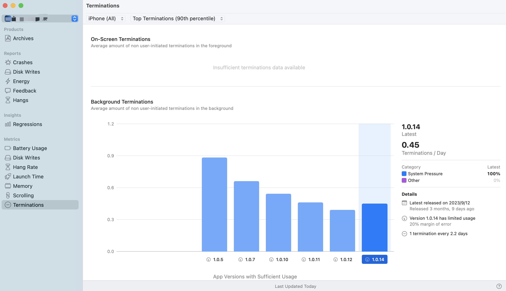

## 事件处理和渲染管道

对于单个用户输入事件，事件在系统中有以下几个步骤：


* 用户点击：用户通过执行单击、点击或按压与输入设备进行交互。

* 硬件：如鼠标、触摸屏或键盘可识别输入，并将其转发到操作系统 （OS）。

* OS 事件传递：操作系统确定负责处理用户输入事件的进程，该事件通常是当前处于活动状态的应用或拥有发生事件的窗口的应用。

* 主线程工作：系统将事件放入特定于应用的队列中，应用的主线程负责选取事件并处理它们。

* 渲染服务器：渲染服务器是一个单独的进程，用于处理需要绘制到屏幕上的各种进程的所有渲染。它将应用程序和系统处理中的层树合成为最终图像。

* 更新显示：当表示新帧的最终图像准备就绪时，显示驱动程序将使用它来更新显示。显示驱动程序会定期检查，以确定屏幕是否需要更新。显示更新可以开始的时间称为垂直同步或垂直同步，两次潜在显示更新之间的时间称为垂直同步间隔或显示刷新间隔。

## 应用程序中的挂起

当处理离散用户交互的延迟变得明显时，这段无响应的时期称为挂起（hang）。


### 分析挂起

* 将 UI 更新工作与非 UI 任务（例如加载更新的数据）分开，并确保非 UI 工作在后台队列上运行。
* 在主线程执行过多工作的地方查找挂起。

调查是否可以执行更少的工作，例如仅重新加载当前可见对象的数据，而不是重新加载列表中的每个对象，即使它不在屏幕上也是如此。

### 主线程的工作

处理传入事件并相应地更新 UI 是应用主线程的职责。作为处理事件的一部分，主线程执行以下工作：

* Delivers the event to the right place and calls the right handler.
将事件传递到正确的位置并调用正确的处理程序。

* Makes any state changes, fetches data, updates the UI, and so on.
进行任何状态更改、提取数据、更新 UI 等。

* Performs a Core Animation (CA) commit, which submits all the changes of the view hierarchy to the render server. The UI framework usually performs the CA commit automatically when your code finishes handling the event.
执行核心动画 （CA） 提交，将视图层次结构的所有更改提交到渲染服务器。UI 框架通常在代码处理完事件后自动执行 CA 提交。


### 主运行循环

运行循环为线程提供了一种机制，用于等待输入源，并在任何这些源有数据或事件要处理时触发输入处理程序。任何线程都可以有一个运行循环。主线程在应用完成启动后立即启动运行循环，即主运行循环。这是处理所有传入用户交互事件的运行循环。

以下是 Run Loop 简化的类似实现
``` Swift
class RunLoop {
    var stopped = false
    
    func run() {
        repeat {
            if let work = workSet.fetchNextWorkItem() {
                processWork(work)
            } else {
                sleepUntilNewWorkArrives()
            }
        } while(!stopped)
    }
}
```

调用 run 后，run 循环继续无限循环运行，检查要处理的新工作。如果有工作要做，运行循环会通过调用适当的处理程序来处理它。如果没有任何工作，它将进入睡眠状态，这意味着主线程也会进入睡眠状态，因此它不会运行。如果有新的工作项传入，操作系统将唤醒主线程，其运行循环在返回睡眠状态之前处理传入的工作。

系统需要在主线程上执行的任何工作（如更新 UI）都将成为提交到运行循环的工作项，然后运行循环会尽快处理它。工作项可能包括：

* Incoming user events 传入用户事件
* A callback of a timer scheduled on the run loop (when a timer fires, it submits its callback to run on the run loop.)
在运行循环中调度的计时器的回调（当计时器触发时，它会提交其回调以在运行循环上运行。
* Work on the main `DispatchQueue`, the main `OperationQueue`, or the main `actor`

## 提高 App 响应能力

为避免挂起和卡顿，开发和测试应用时需要牢记以下粗略阈值：

* < 100 ms：同步主线程响应离散的用户交互
* 1 display refresh interval (8 or 17ms)：主线程工作和处理连续用户交互的工作

在 Apple 设备上，屏幕刷新频率可能高达每秒 120 次，或每 8.3 毫秒一次。Apple 设备的另一个常见显示刷新率是 60Hz，因此每 16.7 毫秒更新一次。

* Avoid hangs by keeping the main thread free from non-UI work
通过使主线程不受非 UI 工作的影响来避免挂起

* Analyze which parts of your app need to execute on the main thread and which don’t
分析应用的哪些任务需要在主线程上执行，哪些不需要

在所有这些任务中，只有从 UIKit 调用操作方法和重新配置应用视图需要使用主线程。该应用可以将所有其他任务异步分派到后台，如下图所示：


* Use high-level concurrency constructs to avoid having too many threads
使用高级并发构造来避免线程过多

* Avoid hitches by minimizing view update time
通过最小化视图更新时间来避免卡顿

* Optimize your app for variable refresh rates
针对可变刷新率优化应用

* Write performance tests to ensure main-thread-bound code completes fast
编写性能测试以确保主线程绑定代码快速完成

* Detect hangs and hang risks
检测挂起和挂起风险

* Find the cause of a hang
查找挂起的原因

* Detect and analyze hitches using `Instruments`
使用 `Instruments` 检测和分析故障

* Get reports and metrics from the field
从现场获取报告和指标

## 减少 App 中的终止

终止是应用生命周期的一部分，无法消除。在 Xcode 中的 `Organizer`查看线上终止情况。


### 终止原因

* **Aborts (Abnormal Exits)**. An abort happens when your process calls abort(). This commonly occurs when your app encounters uncaught exceptions or failed assert() calls, often through a framework that your app uses. An abort makes use of the SIGABRT signal. Aborts are crashes.
中止（异常退出）。当进程调用 abort() 时，会发生中止。当您的应用遇到未捕获的异常或失败 assert() 的调用时，通常会发生这种情况，通常是通过应用使用的框架。中止利用 SIGABRT 信号。中止是崩溃。

* **Memory Limit**. On iOS, the system attempts to provide foreground apps as much memory as possible. If your app attempts to use more memory than the system can provide, the system terminates it.
内存限制。在 iOS 上，系统会尝试为前台应用提供尽可能多的内存。如果应用尝试使用的内存超过系统所能提供的内存，系统会终止它。

* **Bad Access**. A Bad Access termination happens when your app attempts to access invalid memory; for example, by deferencing null pointers or by attempting to index out of bounds on an array. Bad Access terminations are crashes.
错误的访问。当您的应用尝试访问无效内存时，会发生“访问错误”终止;例如，通过延迟 null 指针或尝试对数组进行越界索引。错误的访问终止是崩溃。

* **Illegal Instruction**. An Illegal Instruction termination happens when your app attempts to execute an instruction that the system cannot interpret. Illegal Instruction terminations are crashes.
非法指令。当您的应用尝试执行系统无法解释的指令时，就会发生非法指令终止。非法指令终止是崩溃。

## 参考

[Understanding user interface responsiveness](https://developer.apple.com/documentation/xcode/understanding-user-interface-responsiveness)

[Understanding hangs in your app](https://developer.apple.com/documentation/xcode/understanding-hangs-in-your-app)

[Diagnosing performance issues early](https://developer.apple.com/documentation/xcode/diagnosing-performance-issues-early)

[Improving app responsiveness](https://developer.apple.com/documentation/xcode/improving-app-responsiveness)

[Reducing terminations in your app](https://developer.apple.com/documentation/xcode/reduce-terminations-in-your-app)

[Why is my app getting killed?](https://developer.apple.com/videos/play/wwdc2020/10078/)

[Reducing disk writes](https://developer.apple.com/documentation/xcode/reducing-disk-writes)