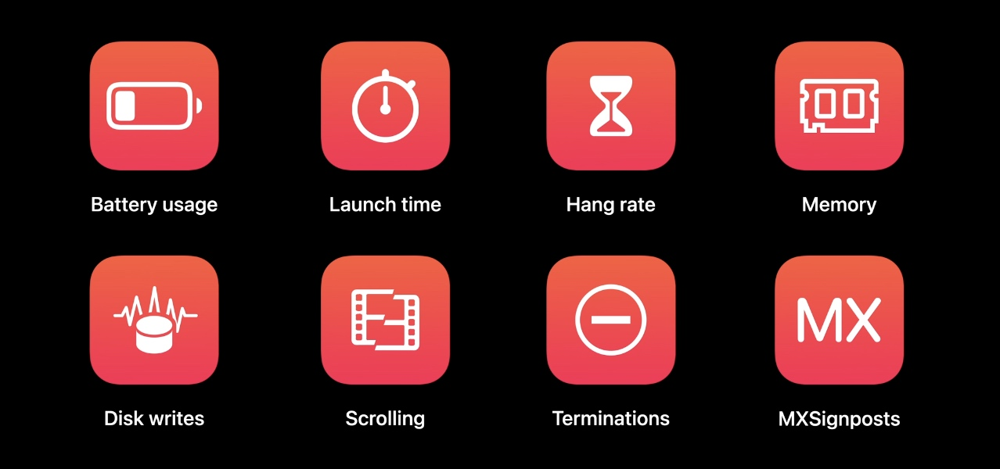
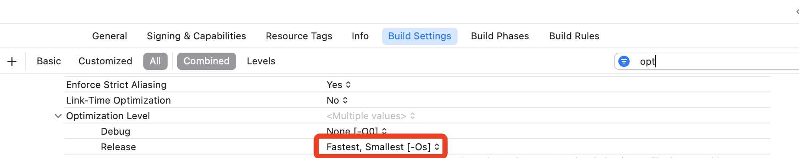
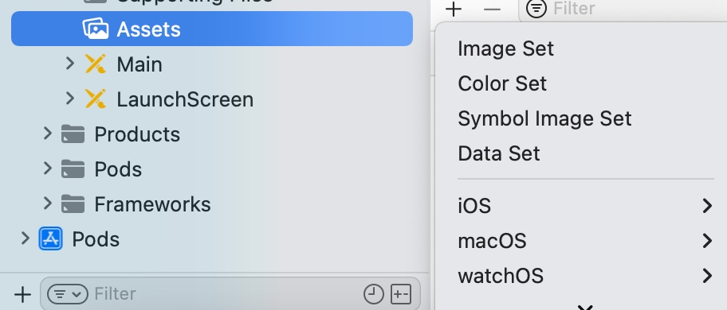
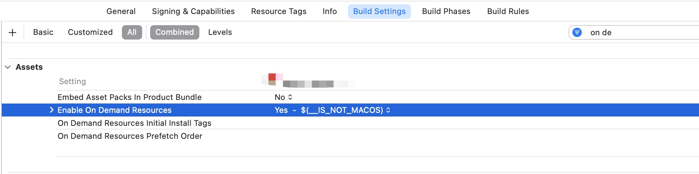
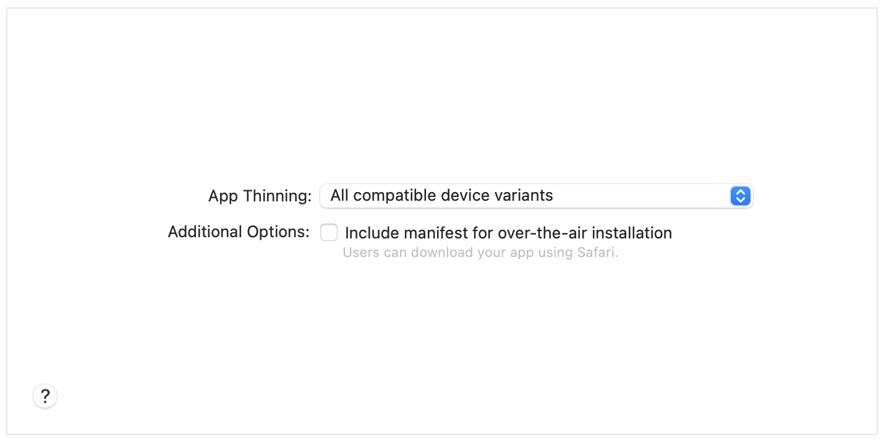
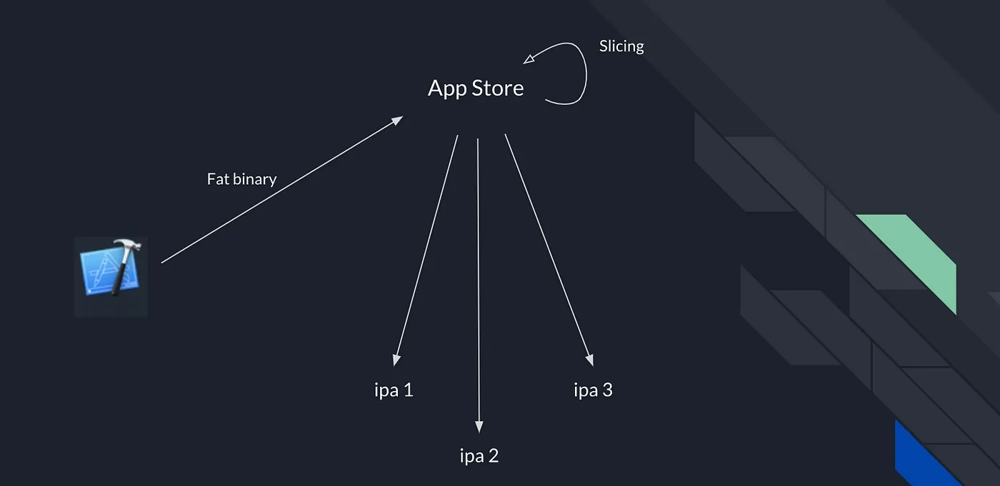

## 概述

APM（Application Performance Monitoring）是一种应用性能监控技术，旨在帮助开发人员和运维团队实时监测和管理应用程序的性能。`APM` 提供了一系列工具和功能，用于收集、分析和可视化应用程序的关键性能指标，以便及时发现和解决性能问题，提高应用程序的可用性和用户体验。

下面是`APM`的几个主要组成部分和功能：

* 实时监控：APM工具能够实时收集和监控应用程序的关键性能指标，如响应时间、吞吐量、错误率、资源利用率等。通过实时监控，开发人员可以及时了解应用程序的运行状态和性能表现。

* 事务跟踪：APM能够对应用程序的事务进行跟踪和分析，以了解每个请求的执行路径、耗时和性能瓶颈。这有助于开发人员确定哪些组件或代码段导致了性能问题，并进行针对性的优化。

* 错误监控：APM工具可以捕获应用程序中的错误和异常，并提供详细的错误报告和堆栈跟踪信息。通过监控错误，开发人员可以快速发现并修复潜在的bug和异常情况，提高应用程序的稳定性和可靠性。

* 性能分析：APM工具能够对应用程序的性能进行深入分析，以识别性能瓶颈和优化机会。通过分析函数调用、数据库查询、外部服务调用等操作的耗时，开发人员可以找到性能瓶颈并优化关键代码路径。

* 可视化和报告：APM工具通常提供可视化的仪表盘和报表，将收集到的性能指标进行图表化展示和汇总。这些可视化工具使开发人员和运维团队能够直观地了解应用程序的性能趋势和变化，并及时采取措施。

* 跨应用程序和分布式追踪：随着现代应用程序的复杂性增加，分布式架构和微服务的使用越来越多。APM工具能够提供跨应用程序和分布式环境的追踪和监控功能，帮助开发人员在整个应用程序生态系统中进行端到端的性能监控和故障排查。

iOS 领域的性能关键指标主要是以上这八个方面，使用的系统工具主要有：
* Xcode Organizer
* MetricKit
* Instruments
* XCTest
* App Store Connect API

## 电池使用优化

电池消耗主要跟三方面因素有关：
* CPU（绘制页面、计算、处理网络数据）
* 网络
* 定位

## App 大小优化

### 基础优化

* Check your target’s build settings for release builds

Xcode->Target->Build Settings里的`Optimization Level`默认优化级别是`Fastest, Smallest [-Os]`，这个优化级别可以使得二进制文件变得非常小。

* Identify and remove unused assets

* Adopt asset catalogs for your app’s resources

使用`Assets`，而不是直接放入 `App Bundle` 中

* Use asset files for data that ships with your app
将资产文件用于应用附带的数据

检查应用的 `IPA` 文件时，。会发现应用的二进制文件占用了大量空间。如果应用附带数据，请考虑使用资产文件，而不是将数据放入代码中。例如，使用属性列表将任何数据与应用捆绑在一起，而不是在代码中使用字符串。

### 高级优化

* Optimize your app’s asset files

    - 尽可能使用最有效的图像和视频格式。将 `HEIF` 格式用于图像，将 `HEVC` 格式用于视频。如使用的是 PNG 文件，请考虑使用 8 位而不是 32 位 PNG。
    - 压缩图像。对于 32 位图像，可考虑` Web`格式，可以大大减小 JPEG 和 PNG 图像的大小
    - 压缩音频文件。使用 AAC 或 MP3 编解码器压缩音频，并尝试降低比特率。44.1 kHz 采样率不是必需的，较低的比特率剪辑不会导致明显的质量下降。

* Reduce the size of app updates
    
    - 不要对文件进行不必要的修改
    - 将希望在更新中更改的内容与不希望更改的内容存储在不同的文件中

当 App 有可用更新时，App Store 不会总是下载整个 App，而是会创建一个更新包。它会将应用的一个或多个早期版本与新版本进行比较，并创建优化的包。此包仅包含应用版本之间已更改的内容，不包括任何未更改的内容。

此比较着眼于应用程序包中的所有内容，包括应用程序可执行文件、storyboards、nibs、localizations和其他资源（如图像）。

* Adopt on-demand resources

iOS 9 及以上系统默认启用此功能

* Leverage app thinning

应用瘦身是一种技术，可确保应用的 IPA 文件仅包含在特定设备上运行应用所需的资源和代码。App Store 中提供的 App 以及 TestFlight 分发给测试人员的 App 已经利用了 App 瘦身功能。

使用 Xcode 导出 App，然后在导出工作表中选择“所有兼容的设备变体”以对 App 进行瘦身。如果应用中仅支持有限数量的设备，请选择适用的设备。

Enable `Bitcode`

Bitcode 是编译程序的中间表示，类似于 JAVA 中的字节码。在启用 `Bitcode` 的情况下存档应用程序时，编译器会生成包含位码而不是机器码的二进制文件。将二进制文件上传到 App Store 后，位码将被编译为机器码。App Store 将来可能会再次编译位码，以利用未来的编译器改进，而无需您执行任何操作。

## 参考

### 文章
[Doing basic optimization to reduce your app’s size](https://developer.apple.com/documentation/xcode/doing-basic-optimization-to-reduce-your-app-s-size)

[Doing advanced optimization to further reduce your app’s size](https://developer.apple.com/documentation/xcode/doing-advanced-optimization-to-further-reduce-your-app-s-size)

[Reducing your app’s size](https://developer.apple.com/documentation/xcode/reducing-your-app-s-size)

[On-Demand Resources Guide](https://developer.apple.com/library/archive/documentation/FileManagement/Conceptual/On_Demand_Resources_Guide/index.html#//apple_ref/doc/uid/TP40015083)

[Distribution Options](https://help.apple.com/xcode/mac/11.0/index.html?localePath=en.lproj#/devde46df08a)

[What is app thinning?](https://help.apple.com/xcode/mac/11.0/index.html?localePath=en.lproj#/devbbdc5ce4f)

[App thinning, Bitcode, Slicing: tutorial](https://ankur-s20.medium.com/implementing-app-thinning-in-your-project-step-by-step-tutorial-ios-app-b3cfd139896d)

### 视频

[Optimize app power and performance for spatial computing](https://developer.apple.com/videos/play/wwdc2023/10100)

[Ultimate application performance survival guide](https://developer.apple.com/videos/play/wwdc2021/10181)

