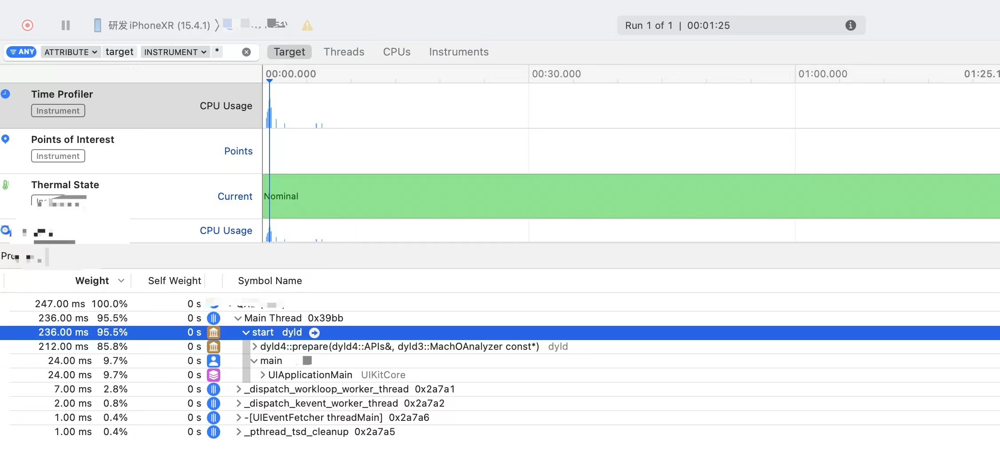

## App launch sequence

App 启动涉及一系列复杂的步骤，大部分由系统自动处理。


* 加载应用程序：当用户点击应用程序的图标时，iOS 系统会加载应用程序的可执行文件（即应用程序的二进制文件）到内存中。
    
    - 解析 Info.plist
        * 加载相关信息，例如如闪屏
        * 沙箱建立、权限检查
    - Mach-O 加载
        * 如果是胖二进制文件，寻找合适当前 CPU 类别的部分
        * 加载所有依赖的Mach-O文件（递归调用 Mach-O 加载的方法）
        * 定位内部、外部指针引用，例如字符串、函数等
        * 执行声明为 __attribute__((constructor)) 的C函数
        * 加载类扩展（Category）中的方法
        * C++ 静态对象加载、调用 ObjC 的 +load 函数

* 运行时初始化：在加载应用程序后，系统会执行一些运行时初始化操作。这包括创建应用程序的主运行循环（Main Run Loop）、设置应用程序的委托（Delegate）以及初始化应用程序的主窗口（Main Window）。

* 应用程序委托回调：应用程序的委托对象（通常是 AppDelegate 类的实例）会收到一系列回调方法，这些方法允许开发者在应用程序的不同生命周期阶段执行自定义操作。例如，application(_:didFinishLaunchingWithOptions:) 方法会在应用程序启动完成后调用，开发者可以在此方法中进行一些初始化设置。

* 显示启动界面（Launch Screen）：在应用程序启动期间，系统会显示一个启动界面，让用户知道应用程序正在加载。启动界面通常是一个静态的图片或者一个包含应用程序标志性元素的界面，它会在应用程序启动完成之前一直显示。

* 加载主视图控制器：一旦应用程序的启动过程完成，系统会加载应用程序的主视图控制器。主视图控制器负责管理应用程序的主界面，并将其显示给用户。

* 应用程序准备就绪：当主视图控制器加载完成并显示给用户后，应用程序被认为是准备就绪。此时，用户可以与应用程序进行交互，执行各种操作。


## About the UI restoration process


## Reducing app’s launch time

### 应用激活

当用户单击您的图标或以其他方式返回您的应用时，就会发生激活。

* 在 iOS 上，激活可以是启动或恢复。启动是指流程需要启动，而恢复是指应用已经有一个进程处于活动状态，即使已挂起也是如此。恢复通常要快得多，优化启动和恢复的工作也不同。
* 在 macOS 上，系统不会在正常使用过程中终止的进程。激活可能需要系统从压缩器引入内存、交换和重新渲染。

### 启动类型

* 冷启动（cold launch）：从零开始启动 App
* 热启动（warm launch）：App 已经在内存中，在后台存活着，点击图标或者其它方式再次启动

### 收集应用启动时间的相关指标

通过 Xcode->【Window】->【Organizer】->【Launch Time】查看用户点击图标与绘制第一个屏幕（静态初始屏幕之后）之间的毫秒数


除了启动时间外，[MetricKit](https://developer.apple.com/documentation/metrickit) 还会报告恢复应用程序的时间，[MXAppLaunchMetric](https://developer.apple.com/documentation/metrickit/mxapplaunchmetric) 包含前一天的启动和恢复时间的直方图。

### 使用 Instruments 分析启动时间

打开 Instruments，选择 Time Profiler

以上，我们可以看到整个启动过程中的时间花销


### 减少启动时间的一些措施

* Reduce dependencies on external frameworks and dynamic libraries
减少对外部框架和动态库的依赖

* Remove or reduce the static initializers in your code
删除或减少代码中的静态初始值设定项

    - C++ static constructors C++ 静态构造函数
    - Objective-C +load methods defined in classes or categories 在类或类别中定义的 Objective-C +load 方法
    - Functions marked with the clang attribute __attribute__((constructor)) 标有 clang 属性 __attribute__((constructor)) 的函数
    - Any function linked into the __DATA,__mod_init_func section of an app or framework binary 链接到应用或框架二进制 __DATA,__mod_init_func 文件部分的任何函数

* Move expensive tasks out of your app delegate
将成本高昂的任务移出应用委托

* Reduce the complexity of your initial views
降低初始视图的复杂性

* Track additional startup activities
跟踪其他启动活动

跟踪其他启动活动，在应用中用这个类别 [pointsOfInterest](https://developer.apple.com/documentation/os/oslog/category/3006878-pointsofinterest) 创建一个 OSLog 对象。使用该 os_signpost 函数记录应用准备任务的开始和结束，如以下示例所示
``` Swift
class ViewController: UIViewController {
    static let startupActivities:StaticString = "Startup Activities"
    let poiLog = OSLog(subsystem: "com.example.CocoaPictures", category: .pointsOfInterest)


    override func viewDidAppear() {
        super.viewDidAppear()
        os_signpost(.begin, log: self.poiLog, name: ViewController.startupActivities)
        // do work to prepare the view
        os_signpost(.end, log: self.poiLog, name: ViewController.startupActivities)
    }
}
```
## 参考

[About the app launch sequence](https://developer.apple.com/documentation/uikit/app_and_environment/responding_to_the_launch_of_your_app/about_the_app_launch_sequence/)

[About the UI restoration process](https://developer.apple.com/documentation/uikit/view_controllers/preserving_your_app_s_ui_across_launches/about_the_ui_restoration_process)

[Reducing your app’s launch time](https://developer.apple.com/documentation/xcode/reducing-your-app-s-launch-time/)

