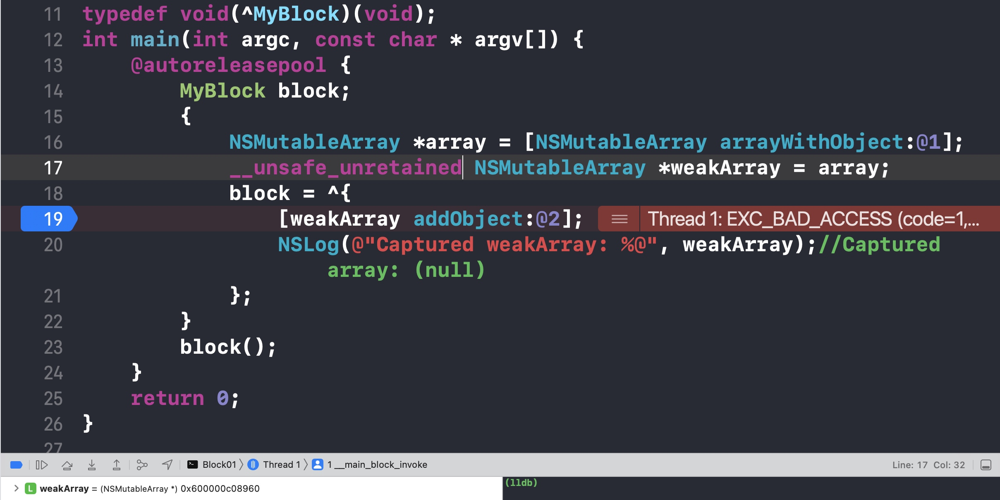

## block基础

[block](https://developer.apple.com/library/archive/documentation/Cocoa/Conceptual/Blocks/Articles/00_Introduction.html) 对象是 C 级语法和运行时功能，类似于 C 函数，但除了可执行代码之外，它们还可能包含与自动（堆栈）或托管（堆）内存的变量绑定。因此，Block 可以维护一组状态（数据），在执行时可以使用这些状态（数据）来影响行为。Block 适用于 OS X v10.6 及更高版本以及 iOS 4.0 及更高版本中。在 C/C++、Objective-C/Objective-C++ 四门编程语言中都可以使用 Block。


### 定义block
`return type` (^ block_name) (type_arguments) = ^ `return type` (type arguments) {\/*body\*/}

* ^不能省略，block标识
* 参数列表为空时可省去

一个简单的`block`如下：

``` ObjC
^(void){
    NSLog(@"Hello, World!");
};
```

可以简化为
``` ObjC
^{
    NSLog(@"Hello, World!");
};
```

### 调用block

上面的并不会打印信息，需要调用block：
``` ObjC
^{
    NSLog(@"Hello, World!");
}();//()执行Block
```

通常我们希望block不立即调用，所以会选择用变量保存起来，在合适的时机调用。

``` ObjC
int main(int argc, const char * argv[]) {
    @autoreleasepool {
        void (^block)(void) = ^{
            NSLog(@"Hello, World!");
        };
        
        block(); //执行到这里 才会打印信息
    }
    return 0;
}
```

### block的常见用法

* 作为局部变量

returnType (^blockName)(parameterTypes) = ^returnType(parameters) {...};

* 作为属性

@property (nonatomic, copy, nullability) returnType (^blockName)(parameterTypes);

* 作为方法的参数

[someObject someMethodThatTakesABlock:^returnType (parameters) {...}];

* 作为方法的返回值

\- (returnType (^)(parameters))methodName;

* typedef

`typedef` returnType (^TypeName)(parameterTypes);
TypeName blockName = ^returnType(parameters) {...};

### block的类型

block有三种类型，最终都是NSObject类型。(继承关系示例：\__NSGlobalBlock__ -> NSBlock -> NSObject)
* \__NSGlobalBlock__ （ _NSConcreteGlobalBlock ），数据区域（.data区），没有访问`auto`变量
* \__NSStackBlock__ （ _NSConcreteStackBlock ），栈区，访问了`auto`变量（需要关闭ARC查看）
* \__NSMallocBlock__ （ _NSConcreteMallocBlock ），堆区，\__NSStackBlock\__调用了`copy`

```ObjC
int main(int argc, const char * argv[]) {
    @autoreleasepool {
        NSInteger age = 10;
        void (^block)(void) = ^{
            NSLog(@"Hello, World! %zd",age);
        };
        
        block();
        NSLog(@"%@",[block class]);//__NSStackBlock__ //非ARC
    }
    return 0;
}
```

每一种类型的block调用copy后的结果如下所示：

| Block的类     | 副本源的存储区域     | copy效果     |
| ------- | ------- | ------- |
| \__NSStackBlock__ | 栈 | 从栈复制到堆 |
| \__NSGlobalBlock__ | 数据区域 | 什么也不做 |
| \__NSMallocBlock__ | 堆 | 引用计数加1 |

### block的copy

在 ARC 环境下，编译器会根据情况自动将栈上的 block 复制到堆上，比如以下情况：
* block作为函数返回值时
* 将block赋值给__strong指针时
* block作为Cocoa API中方法名含有usingBlock的方法参数时
* block作为GCD API的方法参数时

## block的本质

将上面的OC代码转换为C/C++代码：

``` sh
xcrun  -sdk  iphoneos  clang  -arch  arm64  -rewrite-objc main.m -o main.cpp
```
如需要链接其他框架，使用-framework参数。比如-framework UIKit

此时 main() 函数部分核心代码大致如下：

``` cpp
struct __main_block_impl_0 {
  struct __block_impl impl;
  struct __main_block_desc_0* Desc;
  __main_block_impl_0(void *fp, struct __main_block_desc_0 *desc, int flags=0) {
    impl.isa = &_NSConcreteStackBlock;
    impl.Flags = flags;
    impl.FuncPtr = fp;
    Desc = desc;
  }
};
static void __main_block_func_0(struct __main_block_impl_0 *__cself) {

            NSLog((NSString *)&__NSConstantStringImpl__var_folders_ph_d87wdl_x6hgcl144wjfl9msr0000gn_T_main_9baa75_mi_0);
        }

static struct __main_block_desc_0 {
  size_t reserved;
  size_t Block_size;
} __main_block_desc_0_DATA = { 0, sizeof(struct __main_block_impl_0)};
int main(int argc, const char * argv[]) {
    /* @autoreleasepool */ { __AtAutoreleasePool __autoreleasepool; 
        void (*block)(void) = ((void (*)())&__main_block_impl_0((void *)__main_block_func_0, &__main_block_desc_0_DATA));
        ((void (*)(__block_impl *))((__block_impl *)block)->FuncPtr)((__block_impl *)block);
    }
    return 0;
}
```

将 main() 函数简化一下

``` cpp
int main(int argc, const char * argv[]) {
    /* @autoreleasepool */ { __AtAutoreleasePool __autoreleasepool; 
    
        //定义block
        void (*block)(void) = &__main_block_impl_0(__main_block_func_0, &__main_block_desc_0_DATA));
    
        //执行block
        block->FuncPtr(block);
    }
    return 0;
}
```

再把`__main_block_impl_0`、`__block_impl`和`__main_block_desc_0`也简化一下：

``` cpp
struct __main_block_desc_0 {
  size_t reserved;
  size_t Block_size;
};

struct __block_impl {
  void *isa;
  int Flags;
  int Reserved;
  void *FuncPtr;
};

struct __main_block_impl_0 {
  struct __block_impl impl;
  struct __main_block_desc_0* Desc;
};
```

在 main() 函数里稍微加点代码：

``` ObjC
int main(int argc, const char * argv[]) {
    @autoreleasepool {
        void (^block)(void) = ^{
            NSLog(@"Hello, World!");
        };
        
        struct __main_block_impl_0 *blk_struct = (__bridge struct __main_block_impl_0 *)block;
        
        block();
    }
    return 0;
}
```

再打两个断点


发现定义的`block`与`__main_block_impl_0`可以转换成功，`blk_struct`里面`impl`的`FuncPtr`指向`0x100003f10`。

此时，过掉第35行断点，卡在第31行，用汇编查看

可以看到block的入口也是`FuncPtr`指向的地址。综上分析，可以知道`block`的底层原理：

* block是一个OC对象，内部也有个isa指针
* block是封装了函数调用以及函数调用环境的OC对象
* block的底层结构大致如下所示


- isa指针，所有对象都有该指针，用于实现对象相关的功能。
- flags，用于按bit位表示一些block的附加信息。
- reserved，保留变量。
- invoke，函数指针，指向具体的block实现的函数调用地址。
- descriptor，表示该block的附加描述信息，主要是size大小，以及copy和dispose函数的指针。
- variables，capture过来的变量，block能够访问它外部的局部变量，就是因为将这些变量（或变量的地址）复制到了结构体中。

## block的变量捕获
在Objective-C中，Block的变量捕获（Variable Capture）是指在定义Block时，Block可以访问并保留（捕获）外部作用域中的变量。这种特性允许Block在其生命周期内引用和使用外部变量，即使在变量超出作用域后仍然有效。

### 原理
Block的变量捕获是通过将外部变量复制到Block内部的结构体中实现的。当Block被定义时，编译器会自动创建一个包含Block代码和捕获变量的结构体，这个结构体就是Block的底层实现。当Block内部需要访问外部变量时，实际上是通过这个结构体中的捕获变量来访问的。Block内部专门新增一个成员来存储外部变量的值。

### 原因
Block的变量捕获是为了解决两个问题：生命周期和作用域。

* **生命周期**：当一个Block在定义时捕获了外部变量，Block会将捕获的变量的值复制到Block自身的结构体中。这样，即使变量超出了其作用域，Block仍然可以访问和使用这些变量的复制值，确保了Block在执行时变量值的正确性。

* **作用域**：Block的变量捕获使得Block可以在其定义的作用域之外使用外部变量。这对于异步编程和回调机制非常有用，因为Block可以在后台线程或异步任务完成后执行，而仍然可以访问和使用在其定义作用域内的变量。

### 实现
Block的变量捕获有三种方式：自动变量捕获、静态变量捕获和全局变量捕获。

1、自动变量捕获（Auto Variable Capture）：

* 当Block内部需要访问一个自动变量时，Block会自动将该变量的值复制到Block结构体中，以便在Block执行时使用。
* 自动变量捕获是通过将变量的值复制到Block结构体中的成员变量来实现的。

编写一个简单的程序来探究Block对于自动变量的捕获是如何实现的。首先看`基本数据类型`的自动变量捕获：

``` Objc
int main(int argc, const char * argv[]) {
    @autoreleasepool {
        int outsideValue = 10;
        void (^myBlock)(void) = ^{
            NSLog(@"Captured value: %d", outsideValue);
        };
        myBlock(); // 输出 Captured value: 10
    }
    return 0;
}
```
也将这段代码转为C++，核心部分如下所示：
``` cpp
struct __main_block_impl_0 {
  struct __block_impl impl;
  struct __main_block_desc_0* Desc;
  int outsideValue;
  __main_block_impl_0(void *fp, struct __main_block_desc_0 *desc, int _outsideValue, int flags=0) : outsideValue(_outsideValue) {
    impl.isa = &_NSConcreteStackBlock;
    impl.Flags = flags;
    impl.FuncPtr = fp;
    Desc = desc;
  }
};
static void __main_block_func_0(struct __main_block_impl_0 *__cself) {
  int outsideValue = __cself->outsideValue; // bound by copy

            NSLog((NSString *)&__NSConstantStringImpl__var_folders_ph_d87wdl_x6hgcl144wjfl9msr0000gn_T_main_6196ba_mi_0, outsideValue);
        }

static struct __main_block_desc_0 {
  size_t reserved;
  size_t Block_size;
} __main_block_desc_0_DATA = { 0, sizeof(struct __main_block_impl_0)};
int main(int argc, const char * argv[]) {
    /* @autoreleasepool */ { __AtAutoreleasePool __autoreleasepool; 
        int outsideValue = 10;
        void (*myBlock)(void) = ((void (*)())&__main_block_impl_0((void *)__main_block_func_0, &__main_block_desc_0_DATA, outsideValue));
        outsideValue = 20;
        ((void (*)(__block_impl *))((__block_impl *)myBlock)->FuncPtr)((__block_impl *)myBlock);
    }
    return 0;
}
```
可以看到Block内部生成一个变量`int outsideValue`来保存外部的自动变量，而且是`值传递`。

再来看`对象类型`的自动变量捕获，先看默认所有权修饰符（即__strong）的情况：
``` ObjC
typedef void(^MyBlock)(void);
int main(int argc, const char * argv[]) {
    @autoreleasepool {
        MyBlock block;
        {
            NSMutableArray *array = [NSMutableArray arrayWithObject:@1];
            block = ^{
                [array addObject:@2];
                NSLog(@"Captured array: %@", array);//Captured array: (1,2)
            };
        }
        block();
    }
    return 0;
}
```

转为C++代码：
``` cpp
struct __main_block_impl_0 {
  struct __block_impl impl;
  struct __main_block_desc_0* Desc;
  NSMutableArray *array;
  __main_block_impl_0(void *fp, struct __main_block_desc_0 *desc, NSMutableArray *_array, int flags=0) : array(_array) {
    impl.isa = &_NSConcreteStackBlock;
    impl.Flags = flags;
    impl.FuncPtr = fp;
    Desc = desc;
  }
};
```

可以看到`__main_block_impl_0`内部有个`NSMutableArray *array`，即`block`将`array`捕获了。现在将上面程序稍微改一下：

``` ObjC
typedef void(^MyBlock)(void);
int main(int argc, const char * argv[]) {
    @autoreleasepool {
        MyBlock block;
        {
            NSMutableArray *array = [NSMutableArray arrayWithObject:@1];
            __weak NSMutableArray *weakArray = array;
            block = ^{
                [weakArray addObject:@2];
                NSLog(@"Captured weakArray: %@", weakArray);//Captured array: (null)
            };
        }
        block();
    }
    return 0;
}
```

此时若按同样方式转C++代码可能报如下错误：
``` sh
/var/folders/ph/d87wdl_x6hgcl144wjfl9msr0000gn/T/main-a9d5ae.mi:17637:28: error: cannot create __weak reference because the current deployment target does not support weak references
            __attribute__((objc_ownership(weak))) NSMutableArray *weakArray = array;
                           ^
1 error generated.
```
需要将命令改成支持ARC、指定运行时系统版本的形式：

``` sh
xcrun -sdk iphoneos clang -arch arm64 -rewrite-objc -fobjc-arc -fobjc-runtime=ios-8.0.0 main.m
```

可以看到`__main_block_impl_0`内部有个`NSMutableArray *__weak weakArray`，
``` cpp
struct __main_block_impl_0 {
  struct __block_impl impl;
  struct __main_block_desc_0* Desc;
  NSMutableArray *__weak weakArray;
  __main_block_impl_0(void *fp, struct __main_block_desc_0 *desc, NSMutableArray *__weak _weakArray, int flags=0) : weakArray(_weakArray) {
    impl.isa = &_NSConcreteStackBlock;
    impl.Flags = flags;
    impl.FuncPtr = fp;
    Desc = desc;
  }
};
```

此时`block`内部虽然捕获了`weakArray`，但是不强持有，过了作用域后`weakArray`销毁了。如果将上述`__weak`改成`__unsafe_unretained`，`block`内部依旧捕获了`weakArray`，但是内部要修改它时可能会发生`EXC_BAD_ACCESS`崩溃。



综上，block对于`对象类型`的自动变量连同所有权修饰符一起捕获。

2、静态变量捕获（Static Variable Capture）：

* 静态变量在整个程序运行期间都存在，并且可以被多个Block访问。
当一个Block捕获了一个静态变量时，多个Block共享同一个静态变量的内存，即使这些Block是在不同的上下文中定义的。
* 静态变量捕获是通过将静态变量的指针复制到Block结构体中的成员变量来实现的。

``` ObjC
int main(int argc, const char * argv[]) {
    @autoreleasepool {
        static NSInteger s_age = 5;
        static int s_data = 42;
        static int *s_Ptr = &s_data;
        
        void (^block) (void) = ^(){
            NSLog(@"%zd-%d",s_age,*s_Ptr); //5-42
        };

        block();
    }
    return 0;
}
```
同样也转为C++代码：
``` cpp
struct __main_block_impl_0 {
  struct __block_impl impl;
  struct __main_block_desc_0* Desc;
  NSInteger *s_age;
  int **s_Ptr;
  __main_block_impl_0(void *fp, struct __main_block_desc_0 *desc, NSInteger *_s_age, int **_s_Ptr, int flags=0) : s_age(_s_age), s_Ptr(_s_Ptr) {
    impl.isa = &_NSConcreteStackBlock;
    impl.Flags = flags;
    impl.FuncPtr = fp;
    Desc = desc;
  }
};
```
可以看到`__main_block_impl_0`中用`*s_age`和`**s_Ptr`分别存储`s_age`和`*s_Ptr`，也就是说block对于静态变量的捕获是以`指针`形式的。

3、全局变量和静态全局变量捕获（Global Variable and Static Global Variable Capture）：

* 全局变量和静态全局变量在整个程序运行期间都存在，并且可以被任何代码访问，包括Block。
* 在Block内部访问全局变量和静态全局变量时，不需要进行特殊的捕获操作，可以直接访问。

``` ObjC
static int g_s_age = 5;
int g_age = 8;
int main(int argc, const char * argv[]) {
    @autoreleasepool {
        void (^block) (void) = ^(){
            NSLog(@"%d-%d",g_s_age,g_age);
        };

        block();
    }
    return 0;
}

struct __main_block_impl_0 {
  struct __block_impl impl;
  struct __main_block_desc_0* Desc;
  __main_block_impl_0(void *fp, struct __main_block_desc_0 *desc, int flags=0) {
    impl.isa = &_NSConcreteStackBlock;
    impl.Flags = flags;
    impl.FuncPtr = fp;
    Desc = desc;
  }
};
```
`__main_block_impl_0`中并无新增成员来存储`g_s_age`和`g_age`，也就是说对于`全局变量`，block是直接访问，不需要捕获。这应该是显而易见的。

需要注意的是，Block的变量捕获可能导致循环引用（retain cycle），特别是在捕获了强引用对象的Block中。为了避免循环引用，可以在Block内部使用弱引用（__weak）来捕获对象，或者使用强弱引用配对（__strong、__weak）来打破循环引用。

### 对象类型的auto变量

当block内部访问了对象类型的auto变量时
* 如果block是在栈上，将不会对auto变量产生强引用

* 如果block被拷贝到堆上
    - 会调用block内部的copy函数
    - copy函数内部会调用_Block_object_assign函数
    - _Block_object_assign函数会根据auto变量的修饰符（__strong、__weak、__unsafe_unretained）做出相应的操作，形成强引用（retain）或者弱引用

* 如果block从堆上移除
    - 会调用block内部的dispose函数
    - dispose函数内部会调用_Block_object_dispose函数
    - _Block_object_dispose函数会自动释放引用的auto变量（release）

| 函数     | 调用时机     |
| ------- | ------- |
| copy函数 | 栈上的block复制到堆上时 |
| dispose函数 | 堆上的block被废弃时 |

## __block修饰符
在Objective-C和C语言中，__block是一个修饰符，用于在Block内部修改在Block外部定义的局部变量。它允许在Block中捕获变量的引用，并且在Block内外对该变量的修改是可见的。

当一个局部变量被__block修饰符修饰时，它的存储方式会从栈上转变为堆上。这意味着该变量的生命周期被延长，使得在Block内部仍然可以访问和修改它。

* __block可以用于解决block内部无法修改auto变量值的问题
* __block不能修饰全局变量、静态变量（static）
* 编译器会将__block变量包装成一个对象

下面举个例子来探究一下__block修饰符：
``` ObjC
int main(int argc, const char * argv[]) {
    @autoreleasepool {
        __block int count = 0;

        void (^increment)(void) = ^{
            count++;
        };

        increment();  // 调用Block，增加count的值
        NSLog(@"Count: %d", count);  // 输出 Count: 1
    }
    return 0;
}
```

转为C++代码：

``` cpp
struct __Block_byref_count_0 {
  void *__isa;
__Block_byref_count_0 *__forwarding;
 int __flags;
 int __size;
 int count;
};

struct __main_block_impl_0 {
  struct __block_impl impl;
  struct __main_block_desc_0* Desc;
  __Block_byref_count_0 *count; // by ref
  __main_block_impl_0(void *fp, struct __main_block_desc_0 *desc, __Block_byref_count_0 *_count, int flags=0) : count(_count->__forwarding) {
    impl.isa = &_NSConcreteStackBlock;
    impl.Flags = flags;
    impl.FuncPtr = fp;
    Desc = desc;
  }
};
static void __main_block_func_0(struct __main_block_impl_0 *__cself) {
  __Block_byref_count_0 *count = __cself->count; // bound by ref

            (count->__forwarding->count)++;
        }
static void __main_block_copy_0(struct __main_block_impl_0*dst, struct __main_block_impl_0*src) {_Block_object_assign((void*)&dst->count, (void*)src->count, 8/*BLOCK_FIELD_IS_BYREF*/);}

static void __main_block_dispose_0(struct __main_block_impl_0*src) {_Block_object_dispose((void*)src->count, 8/*BLOCK_FIELD_IS_BYREF*/);}

static struct __main_block_desc_0 {
  size_t reserved;
  size_t Block_size;
  void (*copy)(struct __main_block_impl_0*, struct __main_block_impl_0*);
  void (*dispose)(struct __main_block_impl_0*);
} __main_block_desc_0_DATA = { 0, sizeof(struct __main_block_impl_0), __main_block_copy_0, __main_block_dispose_0};
int main(int argc, const char * argv[]) {
    /* @autoreleasepool */ { __AtAutoreleasePool __autoreleasepool; 
        __attribute__((__blocks__(byref))) __Block_byref_count_0 count = {(void*)0,(__Block_byref_count_0 *)&count, 0, sizeof(__Block_byref_count_0), 0};
        void (*increment)(void) = ((void (*)())&__main_block_impl_0((void *)__main_block_func_0, &__main_block_desc_0_DATA, (__Block_byref_count_0 *)&count, 570425344));
        ((void (*)(__block_impl *))((__block_impl *)increment)->FuncPtr)((__block_impl *)increment);
        NSLog((NSString *)&__NSConstantStringImpl__var_folders_ph_d87wdl_x6hgcl144wjfl9msr0000gn_T_main_0fa1d8_mi_0, (count.__forwarding->count));
    }
    return 0;
}
```

可以看到block内部将__block修饰的变量`count`包装成了一个对象，即上面的`__Block_byref_count_0`，里面有两个关键指针`isa`和`__forwarding`


一般的，对被捕获变量进行`赋值`操作时需加`__block`修饰符。仅是访问或者使用的情况下是不需要加，例如block内部对被捕获的`NSMutableArray`进行`addObject:`时不需要加。

需要加而未加__block修饰符时，会提示类似如下错误：
```
Variable is not assignable (missing __block type specifier)
```

### __block的内存管理

* 当block在栈上时，并不会对__block变量产生强引用

* 当block被copy到堆时
    - 会调用block内部的copy函数
    - copy函数内部会调用_Block_object_assign函数
    - _Block_object_assign函数会对__block变量形成强引用（retain）

* 当block从堆中移除时
    - 会调用block内部的dispose函数
    - dispose函数内部会调用_Block_object_dispose函数
    - _Block_object_dispose函数会自动释放引用的__block变量（release）

* __block的__forwarding指针


### 对象类型的auto变量、__block变量

* 当block在栈上时，对它们都不会产生强引用

* 当block拷贝到堆上时，都会通过copy函数来处理它们
    __block变量（假设变量名叫做a）
    _Block_object_assign((void*)&dst->a, (void*)src->a, 8/*BLOCK_FIELD_IS_BYREF*/);

    对象类型的auto变量（假设变量名叫做p）
    _Block_object_assign((void*)&dst->p, (void*)src->p, 3/*BLOCK_FIELD_IS_OBJECT*/);

* 当block从堆上移除时，都会通过dispose函数来释放它们
    __block变量（假设变量名叫做a）
    _Block_object_dispose((void*)src->a, 8/*BLOCK_FIELD_IS_BYREF*/);

    对象类型的auto变量（假设变量名叫做p）
    _Block_object_dispose((void*)src->p, 3/*BLOCK_FIELD_IS_OBJECT*/);

### 被__block修饰的对象类型

* 当__block变量在栈上时，不会对指向的对象产生强引用

* 当__block变量被copy到堆时
    - 会调用__block变量内部的copy函数
    - copy函数内部会调用_Block_object_assign函数
    - _Block_object_assign函数会根据所指向对象的修饰符（__strong、__weak、__unsafe_unretained）做出相应的操作，形成强引用（retain）或者弱引用（这里仅限于ARC时会retain，MRC时不会retain）

* 如果__block变量从堆上移除
    - 会调用__block变量内部的dispose函数
    - dispose函数内部会调用_Block_object_dispose函数
    - _Block_object_dispose函数会自动释放指向的对象（release）

## 循环引用

### ARC 环境下的循环引用问题

* 使用`__weak`、`__unsafe_unretained`解决

``` ObjC

- (void)test {
    //使用__weak或者__unsafe_unretained解决
    //__unsafe_unretained typeof(self) weakSelf = self;
    __weak typeof(self) weakSelf = self;
    self.block = ^{
        __strong typeof(self) strongSelf = weakSelf;
        NSLog(@"age is %lud", strongSelf->_age);
    };
}
```

* 使用`__block`解决。必须调用block，且在block内部将`__block`变量置为`nil`
``` ObjC
- (void)test {
    //使用__block解决，必须调用block，且在block内部将__block变量置为nil
    __block id weakSelf = self;
    self.block = ^{
        __strong typeof(self) strongSelf = weakSelf;
        NSLog(@"age is %lud", strongSelf->_age);
        weakSelf = nil;//不能少
    };
    self.block();
}
```

### MRC 环境下的循环引用问题

* 使用`__unsafe_unretained`解决

``` ObjC
- (void)test {
    //使用__unsafe_unretained解决
    __unsafe_unretained id weakSelf = self;
    self.block = ^{
        NSLog(@"%p", weakSelf);
    };
}
```

* 使用`__block`解决
``` ObjC
- (void)test {
    //使用__block解决
    __block id weakSelf = self;
    self.block = ^{
        NSLog(@"%p", weakSelf);
    };
}
```

## 参考

[Blocks Programming Topics](https://developer.apple.com/library/archive/documentation/Cocoa/Conceptual/Blocks/Articles/00_Introduction.html)

[Block Syntax](http://fuckingblocksyntax.com)

[A look inside blocks: Episode 1](https://www.galloway.me.uk/2012/10/a-look-inside-blocks-episode-1/)

[A look inside blocks: Episode 2](https://www.galloway.me.uk/2012/10/a-look-inside-blocks-episode-2/)

[A look inside blocks: Episode 3 (Block_copy)](https://www.galloway.me.uk/2013/05/a-look-inside-blocks-episode-3-block-copy/)

[Closure and anonymous functions in Objective-C](https://xs-labs.com/en/archives/articles/objc-blocks/)