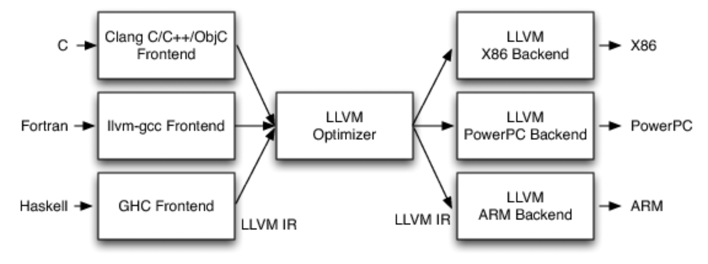
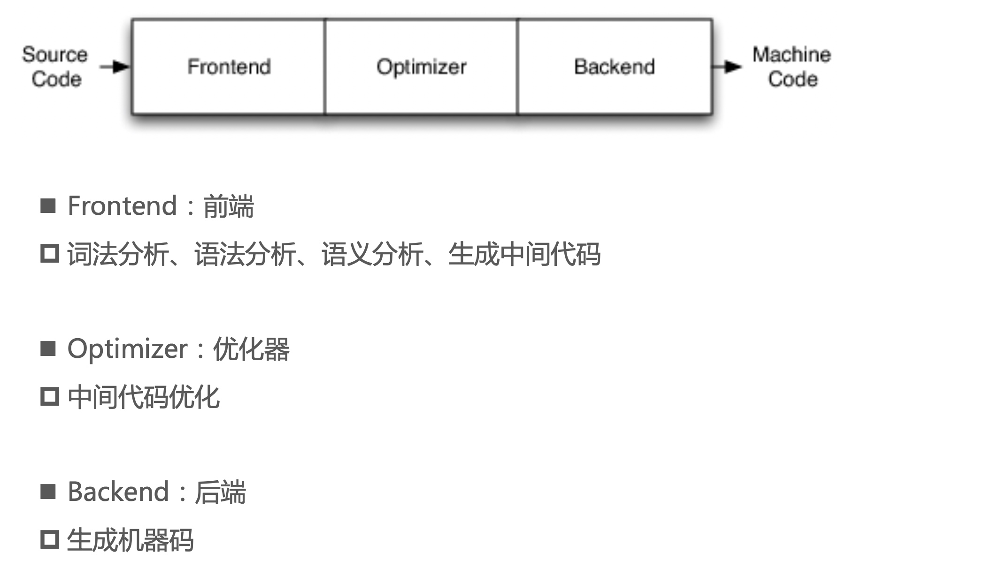
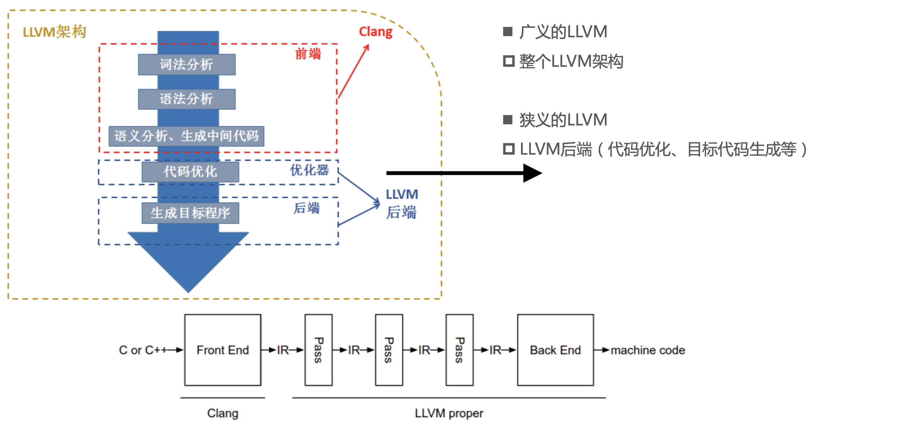

## LLVM概述

LLVM（Low-Level Virtual Machine）是一个开源的编译器基础设施项目，旨在提供一组通用的编译器工具和技术。它提供了一种中间表示（IR）和一套工具链，用于优化和生成高效的机器码。LLVM 的设计目标是提供灵活、可扩展和可重用的编译器技术，适用于各种编程语言和目标平台。

下面是 LLVM 的一些重要组成部分：

* LLVM IR：LLVM 使用一种中间表示语言，称为 LLVM IR。它是一种低级别的静态单赋值（SSA）形式的代码表示，类似于一种虚拟的、类型安全的汇编语言。LLVM IR 是一种面向编译器优化和代码生成的中间表示，可以在多个编译阶段之间传递和转换。

* 前端：LLVM 提供了多个前端，用于将不同的编程语言转换为 LLVM IR。例如，Clang 是 LLVM 的 C/C++/Objective-C 编译器前端，可以将这些语言的源代码转换为 LLVM IR。

* 优化器：LLVM 的优化器是 LLVM 编译器框架的核心组件之一。它执行一系列的优化操作，如常量传播、死代码消除、内联函数、循环优化等。优化器的目标是改善代码的性能和效率，减少生成的机器码的大小和运行时间。

* 后端：LLVM 提供了多个后端，用于将 LLVM IR 转换为特定的目标平台的机器码。每个后端负责针对特定的硬件体系结构生成高度优化的机器码。LLVM 支持多种目标平台，包括 x86、ARM、MIPS 等。

* JIT 编译器：LLVM 提供了即时编译（Just-In-Time，JIT）功能，可以在运行时将 LLVM IR 编译为机器码。这使得编程语言的解释器或虚拟机可以动态地生成和执行优化的机器码，提高程序的执行速度。

* 工具链：LLVM 提供了一个完整的工具链，包括编译器、汇编器、链接器等。这些工具可以用于构建和调试应用程序，支持静态和动态链接，生成可执行文件和共享库。

### LLVM架构


* 不同的前端后端使用统一的中间代码LLVM Intermediate Representation (LLVM IR)
* 如果需要支持一种新的编程语言，那么只需要实现一个新的前端
* 如果需要支持一种新的硬件设备，那么只需要实现一个新的后端
* 优化阶段是一个通用的阶段，它针对的是统一的LLVM IR，不论是支持新的编程语言，还是支持新的硬件设备，都不需要对优化阶段做修改
* 相比之下，GCC的前端和后端没分得太开，前端后端耦合在了一起。所以GCC为了支持一门新的语言，或者为了支持一个新的目标平台，就 变得特别困难
* LLVM现在被作为实现各种静态和运行时编译语言的通用基础结构(GCC家族、Java、.NET、Python、Ruby、Scheme、Haskell、D等)
 
### 
传统的编译器架构

## Clang

Clang 是 LLVM 项目中的一个重要组成部分，是一个开源的 C/C++/Objective-C 编译器前端。它负责将这些编程语言的源代码转换为 LLVM IR，并提供了丰富的语言分析和编译功能。

以下是 Clang 的一些特点和功能：

* 高度兼容性：Clang 支持 C、C++ 和 Objective-C 编程语言的广泛特性，并且遵循相应的语言标准，如 C99、C++11、C++14、C++17 等。它的目标是提供与其他主流编译器兼容的编译体验。

* 高性能编译：Clang 借助 LLVM 提供的优化器和代码生成技术，能够生成高度优化的机器码。它执行一系列的静态分析和优化操作，提高代码的执行效率和性能。

* 良好的错误诊断和警告：Clang 在编译过程中能够提供详细的错误信息和警告，帮助开发者快速定位和修复代码中的问题。它的错误信息通常非常清晰和易于理解，并且提供了丰富的静态分析功能。

* 模块化设计：Clang 的设计具有模块化的特点，不同的编译任务由不同的模块完成。这种设计使得 Clang 更容易扩展和定制，开发者可以根据自己的需求添加或修改特定的功能。

* IDE 支持：Clang 提供了用于集成开发环境（IDE）的支持，例如通过 Clang 提供的 API 可以实现代码编辑器的自动补全、语法高亮、代码重构等功能。这使得 Clang 成为许多现代开发工具的重要组成部分。

* 跨平台支持：Clang 可以在多种操作系统上运行，包括 Linux、macOS 和 Windows。它提供了对不同目标平台的交叉编译能力，使开发者能够在一个平台上开发和测试代码，然后将其编译为其他平台上的可执行文件。

### Clang与LLVM

### 常用命令
编写一个简单OC程序，终端分别执行以下命令：
``` ObjC
int main(int argc, const char * argv[]) {
    @autoreleasepool {
        int a = 5;
        int b = 4;
        int c = a + b;
        printf("%d + %d = %d\n",a,b,c);
    }
    return 0;
}
```
* 命令行查看编译的过程:$ clang -ccc-print-phases main.m

``` sh
               +- 0: input, "main.m", objective-c
            +- 1: preprocessor, {0}, objective-c-cpp-output
         +- 2: compiler, {1}, ir
      +- 3: backend, {2}, assembler
   +- 4: assembler, {3}, object
+- 5: linker, {4}, image
6: bind-arch, "x86_64", {5}, image
```
* 查看preprocessor(预处理)的结果:$ clang -E main.m
* 词法分析，生成Token: $ clang -fmodules -E -Xclang -dump-tokens main.m
``` sh
int main(int argc, const char * argv[]) {
    @autoreleasepool {
        int a = 5;
        int b = 4;
        int c = a + b'		Loc=<main.m:9:1>
int 'int'	 [StartOfLine]	Loc=<main.m:12:1>
identifier 'main'	 [LeadingSpace]	Loc=<main.m:12:5>
l_paren '('		Loc=<main.m:12:9>
int 'int'		Loc=<main.m:12:10>
identifier 'argc'	 [LeadingSpace]	Loc=<main.m:12:14>
comma ','		Loc=<main.m:12:18>
const 'const'	 [LeadingSpace]	Loc=<main.m:12:20>
char 'char'	 [LeadingSpace]	Loc=<main.m:12:26>
star '*'	 [LeadingSpace]	Loc=<main.m:12:31>
identifier 'argv'	 [LeadingSpace]	Loc=<main.m:12:33>
l_square '['		Loc=<main.m:12:37>
r_square ']'		Loc=<main.m:12:38>
r_paren ')'		Loc=<main.m:12:39>
l_brace '{'	 [LeadingSpace]	Loc=<main.m:12:41>
at '@'	 [StartOfLine] [LeadingSpace]	Loc=<main.m:13:5>
identifier 'autoreleasepool'		Loc=<main.m:13:6>
l_brace '{'	 [LeadingSpace]	Loc=<main.m:13:22>
int 'int'	 [StartOfLine] [LeadingSpace]	Loc=<main.m:14:9>
identifier 'a'	 [LeadingSpace]	Loc=<main.m:14:13>
equal '='	 [LeadingSpace]	Loc=<main.m:14:15>
numeric_constant '5'	 [LeadingSpace]	Loc=<main.m:14:17>
semi ';'		Loc=<main.m:14:18>
int 'int'	 [StartOfLine] [LeadingSpace]	Loc=<main.m:15:9>
identifier 'b'	 [LeadingSpace]	Loc=<main.m:15:13>
equal '='	 [LeadingSpace]	Loc=<main.m:15:15>
numeric_constant '4'	 [LeadingSpace]	Loc=<main.m:15:17>
semi ';'		Loc=<main.m:15:18>
int 'int'	 [StartOfLine] [LeadingSpace]	Loc=<main.m:16:9>
identifier 'c'	 [LeadingSpace]	Loc=<main.m:16:13>
equal '='	 [LeadingSpace]	Loc=<main.m:16:15>
identifier 'a'	 [LeadingSpace]	Loc=<main.m:16:17>
plus '+'	 [LeadingSpace]	Loc=<main.m:16:19>
identifier 'b'	 [LeadingSpace]	Loc=<main.m:16:21>
semi ';'		Loc=<main.m:16:22>
identifier 'printf'	 [StartOfLine] [LeadingSpace]	Loc=<main.m:17:9>
l_paren '('		Loc=<main.m:17:15>
string_literal '"%d + %d = %d\n"'		Loc=<main.m:17:16>
comma ','		Loc=<main.m:17:32>
identifier 'a'		Loc=<main.m:17:33>
comma ','		Loc=<main.m:17:34>
identifier 'b'		Loc=<main.m:17:35>
comma ','		Loc=<main.m:17:36>
identifier 'c'		Loc=<main.m:17:37>
r_paren ')'		Loc=<main.m:17:38>
semi ';'		Loc=<main.m:17:39>
r_brace '}'	 [StartOfLine] [LeadingSpace]	Loc=<main.m:18:5>
return 'return'	 [StartOfLine] [LeadingSpace]	Loc=<main.m:19:5>
numeric_constant '0'	 [LeadingSpace]	Loc=<main.m:19:12>
semi ';'		Loc=<main.m:19:13>
r_brace '}'	 [StartOfLine]	Loc=<main.m:20:1>
eof ''		Loc=<main.m:20:2>
```
* 语法分析，生成语法树(AST，Abstract Syntax Tree): $ clang -fmodules -fsyntax-only -Xclang -ast-dump main.m
``` sh
|-ImportDecl 0x7f782e02a798 <main.m:9:1> col:1 implicit Foundation
`-FunctionDecl 0x7f782e02aa70 <line:12:1, line:20:1> line:12:5 main 'int (int, const char **)'
  |-ParmVarDecl 0x7f782e02a7f0 <col:10, col:14> col:14 argc 'int'
  |-ParmVarDecl 0x7f782e02a920 <col:20, col:38> col:33 argv 'const char **':'const char **'
  `-CompoundStmt 0x7f782e02b568 <col:41, line:20:1>
    |-ObjCAutoreleasePoolStmt 0x7f782e02b520 <line:13:5, line:18:5>
    | `-CompoundStmt 0x7f782e02b4f0 <line:13:22, line:18:5>
    |   |-DeclStmt 0x7f782e02ac50 <line:14:9, col:18>
    |   | `-VarDecl 0x7f782e02abc8 <col:9, col:17> col:13 used a 'int' cinit
    |   |   `-IntegerLiteral 0x7f782e02ac30 <col:17> 'int' 5
    |   |-DeclStmt 0x7f782e02ad08 <line:15:9, col:18>
    |   | `-VarDecl 0x7f782e02ac80 <col:9, col:17> col:13 used b 'int' cinit
    |   |   `-IntegerLiteral 0x7f782e02ace8 <col:17> 'int' 4
    |   |-DeclStmt 0x7f782e02b2c0 <line:16:9, col:22>
    |   | `-VarDecl 0x7f782e02ad38 <col:9, col:21> col:13 used c 'int' cinit
    |   |   `-BinaryOperator 0x7f782e02ae40 <col:17, col:21> 'int' '+'
    |   |     |-ImplicitCastExpr 0x7f782e02ae10 <col:17> 'int' <LValueToRValue>
    |   |     | `-DeclRefExpr 0x7f782e02ada0 <col:17> 'int' lvalue Var 0x7f782e02abc8 'a' 'int'
    |   |     `-ImplicitCastExpr 0x7f782e02ae28 <col:21> 'int' <LValueToRValue>
    |   |       `-DeclRefExpr 0x7f782e02add8 <col:21> 'int' lvalue Var 0x7f782e02ac80 'b' 'int'
    |   `-CallExpr 0x7f782e02b438 <line:17:9, col:38> 'int'
    |     |-ImplicitCastExpr 0x7f782e02b420 <col:9> 'int (*)(const char *, ...)' <FunctionToPointerDecay>
    |     | `-DeclRefExpr 0x7f782e02b2d8 <col:9> 'int (const char *, ...)' Function 0x7f782e02ae68 'printf' 'int (const char *, ...)'
    |     |-ImplicitCastExpr 0x7f782e02b490 <col:16> 'const char *' <NoOp>
    |     | `-ImplicitCastExpr 0x7f782e02b478 <col:16> 'char *' <ArrayToPointerDecay>
    |     |   `-StringLiteral 0x7f782e02b338 <col:16> 'char[14]' lvalue "%d + %d = %d\n"
    |     |-ImplicitCastExpr 0x7f782e02b4a8 <col:33> 'int' <LValueToRValue>
    |     | `-DeclRefExpr 0x7f782e02b360 <col:33> 'int' lvalue Var 0x7f782e02abc8 'a' 'int'
    |     |-ImplicitCastExpr 0x7f782e02b4c0 <col:35> 'int' <LValueToRValue>
    |     | `-DeclRefExpr 0x7f782e02b380 <col:35> 'int' lvalue Var 0x7f782e02ac80 'b' 'int'
    |     `-ImplicitCastExpr 0x7f782e02b4d8 <col:37> 'int' <LValueToRValue>
    |       `-DeclRefExpr 0x7f782e02b3a0 <col:37> 'int' lvalue Var 0x7f782e02ad38 'c' 'int'
    `-ReturnStmt 0x7f782e02b558 <line:19:5, col:12>
      `-IntegerLiteral 0x7f782e02b538 <col:12> 'int' 0
```
## LLVM IR

LLVM IR（LLVM Intermediate Representation）是 LLVM 编译器基础设施中的一种中间表示语言。它是一种面向低级别的静态单赋值（SSA）形式的中间表示，被设计用于进行静态分析、优化和代码生成。

以下是 LLVM IR 的一些特点和重要概念：

* 静态单赋值（SSA）形式：LLVM IR 采用静态单赋值形式来表示程序的数据流。在 SSA 形式中，每个变量只能被赋值一次，这使得数据流的分析和转换更加简化和清晰。

* 类型系统：LLVM IR 具有丰富的类型系统，包括整数、浮点数、指针、向量和聚合类型等。这使得 LLVM IR 能够精确表示各种编程语言的数据类型。

* 中间表示层次结构：LLVM IR 是一个多层次的中间表示语言。它包括高级别的通用指令集（如算术运算、条件分支、循环等），以及底层的细粒度指令集（如加载、存储、位操作等）。这种层次结构使得 LLVM IR 可以在不同的优化和代码生成阶段进行灵活的转换和处理。

* 低级别的编程模型：LLVM IR 是一种面向底层的编程模型。它提供了对寄存器、内存、指针和地址空间等底层计算机概念的直接支持。这使得 LLVM IR 能够生成高效的机器码，同时也为底层编程和代码生成技术提供了灵活性。

* SSA 形式的控制流图（CFG）：LLVM IR 使用基本块和控制流指令来表示程序的控制流图。基本块是一组连续的指令序列，其中只有入口和出口两个分支点。控制流指令（如条件分支、无条件分支、循环等）用于在基本块之间进行控制流的转移。

* 可移植性和交叉编译：LLVM IR 的设计目标之一是提供可移植性和交叉编译能力。LLVM IR 可以独立于特定的硬件和操作系统进行优化和代码生成，从而使得开发者能够将其应用于不同的目标平台和架构。

LLVM IR有3种表示形式(但本质是等价的，就好比水可以有气体、液体、固体3种形态) 
* text:便于阅读的文本格式，类似于汇编语言，拓展名.ll， $ clang -S -emit-llvm main.m 
``` sh
; ModuleID = 'main.m'
source_filename = "main.m"
target datalayout = "e-m:o-p270:32:32-p271:32:32-p272:64:64-i64:64-f80:128-n8:16:32:64-S128"
target triple = "x86_64-apple-macosx12.0.0"

@.str = private unnamed_addr constant [14 x i8] c"%d + %d = %d\0A\00", align 1

; Function Attrs: noinline optnone ssp uwtable
define i32 @main(i32 %0, i8** %1) #0 {
  %3 = alloca i32, align 4
  %4 = alloca i32, align 4
  %5 = alloca i8**, align 8
  %6 = alloca i32, align 4
  %7 = alloca i32, align 4
  %8 = alloca i32, align 4
  store i32 0, i32* %3, align 4
  store i32 %0, i32* %4, align 4
  store i8** %1, i8*** %5, align 8
  %9 = call i8* @llvm.objc.autoreleasePoolPush() #1
  store i32 5, i32* %6, align 4
  store i32 4, i32* %7, align 4
  %10 = load i32, i32* %6, align 4
  %11 = load i32, i32* %7, align 4
  %12 = add nsw i32 %10, %11
  store i32 %12, i32* %8, align 4
  %13 = load i32, i32* %6, align 4
  %14 = load i32, i32* %7, align 4
  %15 = load i32, i32* %8, align 4
  %16 = call i32 (i8*, ...) @printf(i8* getelementptr inbounds ([14 x i8], [14 x i8]* @.str, i64 0, i64 0), i32 %13, i32 %14, i32 %15)
  call void @llvm.objc.autoreleasePoolPop(i8* %9)
  ret i32 0
}

; Function Attrs: nounwind
declare i8* @llvm.objc.autoreleasePoolPush() #1

declare i32 @printf(i8*, ...) #2

; Function Attrs: nounwind
declare void @llvm.objc.autoreleasePoolPop(i8*) #1

attributes #0 = { noinline optnone ssp uwtable "darwin-stkchk-strong-link" "frame-pointer"="all" "min-legal-vector-width"="0" "no-trapping-math"="true" "probe-stack"="___chkstk_darwin" "stack-protector-buffer-size"="8" "target-cpu"="penryn" "target-features"="+cx16,+cx8,+fxsr,+mmx,+sahf,+sse,+sse2,+sse3,+sse4.1,+ssse3,+x87" "tune-cpu"="generic" }
attributes #1 = { nounwind }
attributes #2 = { "darwin-stkchk-strong-link" "frame-pointer"="all" "no-trapping-math"="true" "probe-stack"="___chkstk_darwin" "stack-protector-buffer-size"="8" "target-cpu"="penryn" "target-features"="+cx16,+cx8,+fxsr,+mmx,+sahf,+sse,+sse2,+sse3,+sse4.1,+ssse3,+x87" "tune-cpu"="generic" }

!llvm.module.flags = !{!0, !1, !2, !3, !4, !5, !6, !7, !8, !9, !10}
!llvm.ident = !{!11}

!0 = !{i32 2, !"SDK Version", [2 x i32] [i32 13, i32 1]}
!1 = !{i32 1, !"Objective-C Version", i32 2}
!2 = !{i32 1, !"Objective-C Image Info Version", i32 0}
!3 = !{i32 1, !"Objective-C Image Info Section", !"__DATA,__objc_imageinfo,regular,no_dead_strip"}
!4 = !{i32 1, !"Objective-C Garbage Collection", i8 0}
!5 = !{i32 1, !"Objective-C Class Properties", i32 64}
!6 = !{i32 1, !"Objective-C Enforce ClassRO Pointer Signing", i8 0}
!7 = !{i32 1, !"wchar_size", i32 4}
!8 = !{i32 7, !"PIC Level", i32 2}
!9 = !{i32 7, !"uwtable", i32 1}
!10 = !{i32 7, !"frame-pointer", i32 2}
!11 = !{!"Apple clang version 14.0.0 (clang-1400.0.29.202)"}
```
* memory:内存格式
* bitcode:二进制格式，拓展名.bc， $ clang -c -emit-llvm main.m

LLVM IR 具有自己的语法和指令集，以下是 LLVM IR 的一些主要语法要点：

* 数据类型：LLVM IR 支持多种数据类型，包括整数型（如i32、i64）、浮点型（如float、double）、指针型和聚合型（如结构体和数组）。数据类型在声明变量和函数参数时使用。

* 标识符：LLVM IR 中的标识符用于表示变量、函数、基本块和全局符号等。标识符由字母、数字和下划线组成，且不能以数字开头。

* 声明与定义：LLVM IR 使用关键字 declare 和 define 来进行声明和定义。declare 用于声明函数和全局变量，而 define 用于定义函数和全局变量，并给出具体的实现。

* 函数定义：LLVM IR 中的函数定义包括函数签名和函数体。函数签名包括函数返回类型、函数名以及参数列表。函数体由基本块构成，每个基本块由标签（label）和一组指令组成。

* 指令：LLVM IR 的指令用于表示程序的操作和计算。指令使用一种类似于汇编语言的语法，包括指令名称和操作数（源操作数和目标操作数）。指令可以执行诸如算术运算、逻辑运算、内存访问、控制流转移等操作。

* 控制流指令：LLVM IR 提供了一系列控制流指令，用于控制程序的执行流程。包括条件分支指令（br、switch）、无条件分支指令（br）、循环指令（loop）等。这些指令用于实现程序的条件判断和循环控制。

* 基本块：LLVM IR 中的基本块用于表示程序的基本执行单元。每个基本块由一个标签（label）和一组指令组成。基本块之间通过控制流指令进行跳转。

## 参考

[LLVM Language Reference Manual](https://llvm.org/docs/LangRef.html)

[Choosing the Right Interface for Your Application](https://clang.llvm.org/docs/Tooling.html)

[Writing an LLVM Pass](https://llvm.org/docs/WritingAnLLVMPass.html)

[Clang Plugins](https://clang.llvm.org/docs/ClangPlugins.html)