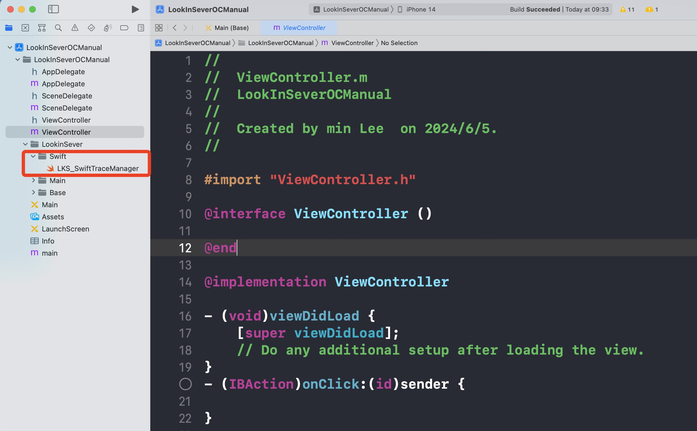
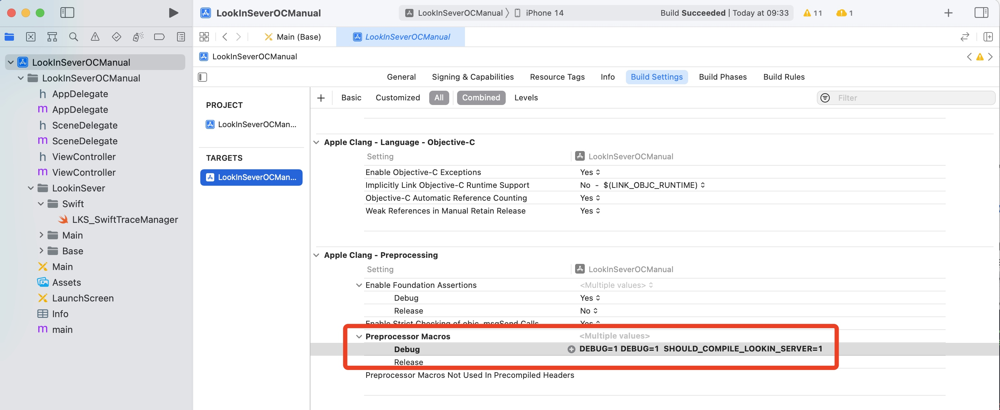
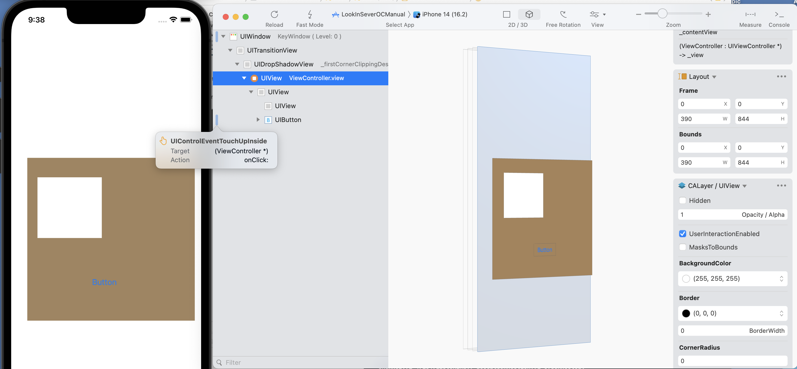

最近逛G站，偶然发现一款 **iOS UI** 调试工具，那就是腾讯 **QMUI团队** 开源的[LookinSever](https://github.com/QMUI/LookinServer)。初步体验了一下，功能还是非常强大，简单记录并分享一下。

## 简介

腾讯的[LookinServer](https://lookin.work/)是一款专为iOS开发者设计的UI调试工具，类似于 Xcode 自带的 `UI Inspector` 工具，或者以前常用的另一款软件`Reveal`。

## 基本功能

**1、实时UI查看：**
LookinServer可以实时捕捉并显示iOS应用的UI层级结构。这包括所有的视图(Views)、控件(Controls)以及它们的属性(Properties)等。

**2、层级视图展示：**
通过图形化界面，开发者可以方便地浏览UI的层级关系。这有助于快速定位UI问题，例如某些视图被错误地覆盖或布局不正确。

**3、属性编辑：**
开发者可以直接在LookinServer中修改视图的属性（如frame、color等），并立即在应用中看到效果。这种所见即所得的调试方式大大加快了UI调整的效率。

**4、视图调试：**
LookinServer支持对单个视图进行详细调试，包括查看其布局约束、事件响应链、以及性能指标等。

## 工作原理

**1、数据抓取：**
LookinServer会将目标iOS应用中的UI数据抓取下来。这通常涉及到通过iOS的运行时(Runtime)机制和反射机制来获取应用当前的UI层级和视图信息。

**2、通信机制：**
LookinServer客户端与iOS应用之间通过网络通信进行数据传输。应用中集成的LookinServer SDK会将视图层级、属性等数据打包发送到LookinServer客户端进行展示。

**3、动态更新：**
当开发者在LookinServer客户端中修改视图属性时，修改指令会通过通信机制发送回iOS应用，应用立即应用这些修改并更新显示。通过这种方式，实现了实时的UI调试。

## 使用场景

**1、UI布局调试：**
快速发现并修正UI布局问题，例如视图错位、层级不正确等。

**2、UI性能优化：**
查看每个视图的性能指标，找出性能瓶颈并进行优化。

**3、快速迭代：**
在开发过程中频繁修改UI时，通过LookinServer可以快速预览效果，减少编译和重启应用的时间。

## 优势

**1、提高效率：**
实时查看和修改UI，大大减少了传统调试方式的时间成本。

**2、直观可视化：**
图形化的视图层级展示，让开发者可以更直观地理解UI结构。

**3、易于集成：**
LookinServer Framework易于集成到现有项目中，支持CocoaPods、 Swift Package Manager以及手动集成，支持OC和Swift，不需要对项目做大的改动。

## 小试牛刀

**1、安装Lookin：**
[官网](https://lookin.work/)下载并安装Lookin Mac客户端。

**2、安装 LookinServer Framework：**

* 通过 **CocoaPods**
    * Swift项目：pod 'LookinServer', :subspecs => ['Swift'], :configurations => ['Debug']
    * ObjC项目：pod 'LookinServer', :configurations => ['Debug']
* 通过 **Swift Package Manager**：https://github.com/QMUI/LookinServer/
* 手动集成：下面以`OC`项目为例
将下载的源码导入项目中，注意`Swift`文件夹里面的可以删除，或者将文件`LKS_SwiftTraceManager.swift`不加到target里参与编译。

在`Debug`模式下，打开`SHOULD_COMPILE_LOOKIN_SERVER`宏定义。

**3、简单使用：**
建个项目，拖几个控件，运行，打开第一步安装的`Lookin`Mac 软件，监测到运行的项目，可以看到视图层级关系、target-action、手势、常见属性设置等，UI及时同步刷新。

## 注意事项

**1、需要在 `Debug` 模式下使用**
**2、使用 `1.0.6`及以后 的版本**

## 总结

腾讯的`LookinServer`是一个强大的`iOS UI`调试工具，其通过实时查看、编辑和调试视图层级和属性，极大地提高了`UI`开发和调试的效率。通过掌握其原理和使用方法，开发者可以更高效地处理`UI`问题，提高应用的整体质量。